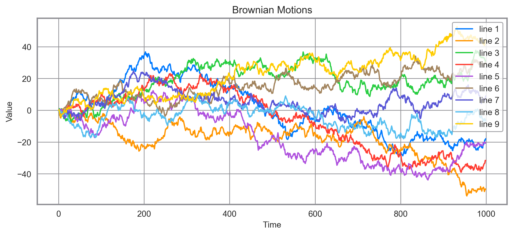

# MPL-HIG

Matplotlib style based on [Human Interface Guidelines](https://developer.apple.com/design/human-interface-guidelines/macos/visual-design/color/) by Apple.



## How to use

```sh
pip install git+https://github.com/simaki/mpl-hig
```

```python
import mpl_hig

mpl_hig.set("whitegrid")
```
